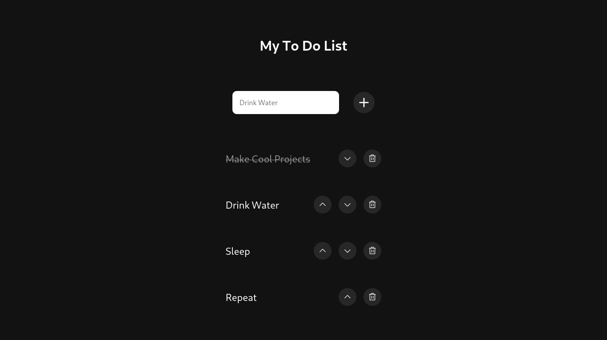

# To Do List Project

## Link

## [to-do-list.vercel](https://paulo-to-do-list.vercel.app/)

## About

This is my 6th project during my journey at Trybe!

To Do list is a simple app that allows users to create and manipulate their tasks in a list. This is a side-project to continue improving my skills in HTML, CSS, and JavaScript.

## Repository Structure

- The `src` folder contains all the code

- The `src/assets` folder contains the images used in the project

## Implemented Features

## Created an input and a button on the page

  

    <strong>An input text and a button have been created to be used for task creation</strong>
  
  

- The page has an input with the `id` named `task-text-input` where the user can enter the text

- The page has a button with the `id` named `add-task-btn` which is responsible for adding the task to the list

## Implemented task creation and display on the page

  

    <strong>Implemented the function to create a new task and display it on the page</strong>
  
  

- The page has a `div` with the `id` named `content`, inside which there is an ordered list (`ol`) with the `id` named `tasks-list`

- When the user enters text in the `task-text-input` and presses **ENTER** or clicks the `add-task-btn`, a **tasks** key is created in the **localStorage** in the format `[{"text":"user-entered text", "completed": false}]`

- For each object present in the **localStorage**, an `li` element is created inside `tasks-list`, rendering the tasks that the user entered in the order they were created

- When attempting to enter a new task without any characters, an error is displayed below the `task-text-input` with the text **Type something!**

- When attempting to enter a task that already exists, an error is displayed below the `task-text-input` with the text **This task already exists**

## Implemented the function to mark a task as done

  

    <strong>By double-clicking on a task, it is marked as done</strong>
  
  

- Tasks are created with the `completed` property set to **false** within the **localStorage** and without the `task-completed` class

- After a task receives a double-click, it gains the `task-completed` class, and the `completed` property is changed to **true** within the **localStorage**

- After a task receives a second double-click, the `task-completed` class is removed, and the value of `completed` reverts to **false**

## Implemented functions to move and remove tasks

  

    <strong>Tasks can be moved up and down and can be removed</strong>
  
  

- During the rendering of the task list, a div with the class `buttons-container` is created inside each `li`

- The `buttons-container` div contains 3 buttons, `up-btn`, `down-btn`, and `remove-btn`

- The `up-btn` button moves the task upwards, the `down-btn` button moves the task downwards, and the `remove-btn` button deletes the task

- The `up-btn` button is not rendered on the first element of the list, and the `down-btn` button is not rendered on the last element of the list

---
